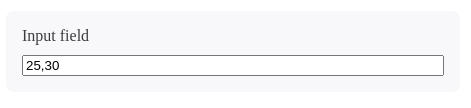

<!-- Improved compatibility of back to top link: See: https://github.com/pedrolgcs/ubli/pull/73 -->
<a name="readme-top"></a>
<!--
*** Thanks for checking out the Best-README-Template. If you have a suggestion
*** that would make this better, please fork the repo and create a pull request
*** or simply open an issue with the tag "enhancement".
*** Don't forget to give the project a star!
*** Thanks again! Now go create something AMAZING! :D
-->

<!-- PROJECT SHIELDS -->
<!--
*** I'm using markdown "reference style" links for readability.
*** Reference links are enclosed in brackets [ ] instead of parentheses ( ).
*** See the bottom of this document for the declaration of the reference variables
*** for contributors-url, forks-url, etc. This is an optional, concise syntax you may use.
*** https://www.markdownguide.org/basic-syntax/#reference-style-links
-->
[![Contributors][contributors-shield]][contributors-url]
[![Forks][forks-shield]][forks-url]
[![Stargazers][stars-shield]][stars-url]
[![Issues][issues-shield]][issues-url]
[![LinkedIn][linkedin-shield]][linkedin-url]

<!-- PROJECT LOGO -->
<br />
<div align="center">
  <a href="https://github.com/pedrolgcs/ubli">
    
  </a>

  <h3 align="center">Ubli</h3>

  <p align="center">
    Seu input de texto para todas as horas!
    <br />
    <a href="https://github.com/pedrolgcs/ubli"><strong>Explore a documentação »</strong></a>
    <br />
    <br />
    <!-- Link To Storybook -->
    <a href="https://github.com/pedrolgcs/ubli">Demo</a> 
    ·
    <a href="https://github.com/pedrolgcs/ubli/issues">Reportar problema</a>
    ·
    <a href="https://github.com/pedrolgcs/ubli/issues">Solicitar funcionalidade</a>
  </p>
</div>

<!-- ABOUT THE PROJECT -->
## Sobre o projeto



Existem muitas bibliotecas de componentes excelentes disponíveis no GitHub; no entanto, não encontrei uma que realmente atendesse às minhas necessidades, então criei esta aprimorada. Acho que é isso.

Aqui está o porquê:
* Facilidade no uso de máscaras em inputs de texto;
* Fácil customização, pois o componente é entregue o mais nativo possível;
* Leve e performático;

Obviamente, essa solução não atenderá a todos os projetos, pois suas necessidades podem ser diferentes. Então estarei adicionando mais funcionalidades no futuro próximo. Você também pode sugerir alterações bifurcando este repositório e criando uma **pull request** ou abrindo uma **issue**.

<p align="right">(<a href="#readme-top">voltar ao topo</a>)</p>

### Construído com

Esse projeto foi desenvolvido utilizando as versões mais recentes das seguintes bibliotecas:

* [![Next][Next.js]][Next-url]
* [![React][React.js]][React-url]
* [![TurboRepo][Turbo]][Turbo-url]
* [![StoryBook][Storybook]][Storybook-url]

<p align="right">(<a href="#readme-top">voltar ao topo</a>)</p>

<!-- GETTING STARTED -->
## Começando

Para colocar uma cópia local em funcionamento, siga estas etapas simples.

### Pre-requisitos

This is an example of how to list things you need to use the software and how to install them.
* npm
  ```sh
  npm install npm@latest -g
  ```
### Instalação

_Below is an example of how you can instruct your audience on installing and setting up your app. This template doesn't rely on any external dependencies or services._

1. Get a free API Key at [https://example.com](https://example.com)
2. Clone the repo
   ```sh
   git clone https://github.com/your_username_/Project-Name.git
   ```
3. Install NPM packages
   ```sh
   npm install
   ```
4. Enter your API in `config.js`
   ```js
   const API_KEY = 'ENTER YOUR API';
   ```

<p align="right">(<a href="#readme-top">back to top</a>)</p>

<!-- USAGE EXAMPLES -->
## Uso

Use this space to show useful examples of how a project can be used. Additional screenshots, code examples and demos work well in this space. You may also link to more resources.

_For more examples, please refer to the [Documentation](https://example.com)_

<p align="right">(<a href="#readme-top">back to top</a>)</p>

<!-- ROADMAP -->
## Roteiro

- [x] Add Changelog
- [x] Add back to top links
- [ ] Add Additional Templates w/ Examples
- [ ] Add "components" document to easily copy & paste sections of the readme
- [ ] Multi-language Support
    - [ ] Chinese
    - [ ] Spanish

See the [open issues](https://github.com/pedrolgcs/ubli/issues) for a full list of proposed features (and known issues).

<p align="right">(<a href="#readme-top">back to top</a>)</p>

<!-- CONTRIBUTING -->
## Contribuindo

Contributions are what make the open source community such an amazing place to learn, inspire, and create. Any contributions you make are **greatly appreciated**.

If you have a suggestion that would make this better, please fork the repo and create a pull request. You can also simply open an issue with the tag "enhancement".
Don't forget to give the project a star! Thanks again!

1. Fork the Project
2. Create your Feature Branch (`git checkout -b feature/AmazingFeature`)
3. Commit your Changes (`git commit -m 'Add some AmazingFeature'`)
4. Push to the Branch (`git push origin feature/AmazingFeature`)
5. Open a Pull Request

<p align="right">(<a href="#readme-top">back to top</a>)</p>

<!-- LICENSE -->
## Licença

Distributed under the MIT License. See `LICENSE.txt` for more information.

<p align="right">(<a href="#readme-top">back to top</a>)</p>

<!-- CONTACT -->
## Contato

Your Name - [@your_twitter](https://twitter.com/your_username) - email@example.com

Project Link: [https://github.com/your_username/repo_name](https://github.com/your_username/repo_name)

<p align="right">(<a href="#readme-top">back to top</a>)</p>

<!-- MARKDOWN LINKS & IMAGES -->
<!-- https://www.markdownguide.org/basic-syntax/#reference-style-links -->
[contributors-shield]: https://img.shields.io/github/contributors/pedrolgcs/ubli.svg?style=for-the-badge
[contributors-url]: https://github.com/pedrolgcs/ubli/graphs/contributors
[forks-shield]: https://img.shields.io/github/forks/pedrolgcs/ubli.svg?style=for-the-badge
[forks-url]: https://github.com/pedrolgcs/ubli/network/members
[stars-shield]: https://img.shields.io/github/stars/pedrolgcs/ubli.svg?style=for-the-badge
[stars-url]: https://github.com/pedrolgcs/ubli/stargazers
[issues-shield]: https://img.shields.io/github/issues/pedrolgcs/ubli.svg?style=for-the-badge
[issues-url]: https://github.com/pedrolgcs/ubli/issues
[license-shield]: https://img.shields.io/github/license/pedrolgcs/ubli.svg?style=for-the-badge
[linkedin-shield]: https://img.shields.io/badge/-LinkedIn-black.svg?style=for-the-badge&logo=linkedin&colorB=555
[linkedin-url]: https://www.linkedin.com/in/pedro-lg/
[product-screenshot]: /images/screenshot.png
[Next.js]: https://img.shields.io/badge/next.js-000000?style=for-the-badge&logo=nextdotjs&logoColor=white
[Next-url]: https://nextjs.org/
[React.js]: https://img.shields.io/badge/React-20232A?style=for-the-badge&logo=react&logoColor=61DAFB
[React-url]: https://reactjs.org/
[Turbo-url]: https://turbo.build/ 
[Turbo]: https://img.shields.io/badge/Turbo-20232A?style=for-the-badge&logo=turborepo
[Storybook-url]: https://storybook.js.org/
[Storybook]: https://img.shields.io/badge/Storybook-20232A?style=for-the-badge&logo=storybook
[Vue.js]: https://img.shields.io/badge/Vue.js-35495E?style=for-the-badge&logo=vuedotjs&logoColor=4FC08D
[Vue-url]: https://vuejs.org/
[Angular.io]: https://img.shields.io/badge/Angular-DD0031?style=for-the-badge&logo=angular&logoColor=white
[Angular-url]: https://angular.io/
[Svelte.dev]: https://img.shields.io/badge/Svelte-4A4A55?style=for-the-badge&logo=svelte&logoColor=FF3E00
[Svelte-url]: https://svelte.dev/
[Laravel.com]: https://img.shields.io/badge/Laravel-FF2D20?style=for-the-badge&logo=laravel&logoColor=white
[Laravel-url]: https://laravel.com
[Bootstrap.com]: https://img.shields.io/badge/Bootstrap-563D7C?style=for-the-badge&logo=bootstrap&logoColor=white
[Bootstrap-url]: https://getbootstrap.com
[JQuery.com]: https://img.shields.io/badge/jQuery-0769AD?style=for-the-badge&logo=jquery&logoColor=white
[JQuery-url]: https://jquery.com 